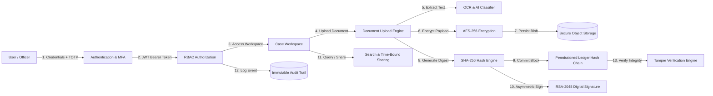
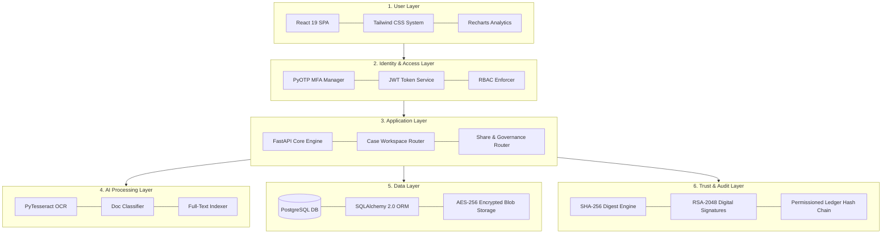

# SecureCase DMS

> **Centralized Case-Centric Document Management Platform for Legal & Investigation Workflows**

[](https://react.dev/)
[](https://fastapi.tiangolo.com/)
[](https://www.postgresql.org/)
[](https://www.typescriptlang.org/)
[](https://tailwindcss.com/)
[](#security-notes)

---

## Problem Statement

**SIH 2026 — Problem Statement 26190**  
Law enforcement agencies and judicial bodies suffer from fragmented evidence management, unverified document revisions, insecure file sharing, and vulnerable chain of custody tracking. **SecureCase DMS** addresses these critical vulnerabilities by providing a centralized, case-centric secure document management platform. Designed specifically for legal and investigative workflows, it incorporates AI-assisted document classification and search, granular role-based access controls (RBAC), end-to-end payload encryption, and a tamper-evident permissioned ledger for immutable chain-of-custody verification.

---

## Features

- **Identity & Access Management**: Multi-Factor Authentication (TOTP via PyOTP with QR code setup) combined with 5 granular Role-Based Access Control levels (Officer, Investigator, Forensic Examiner, Legal Counsel, Admin).
- **Case Management Workspace**: Case-centric document organization (e.g., `C-2026-00124`), case assignment management, team role tracking, and investigation status lifecycles.
- **Document Management & Encryption**: Enforced AES-256 (Fernet) payload encryption at rest, strict file versioning (`v1.enc`, `v2.enc`), MIME-type validation, and full revision lineage.
- **AI & OCR Engine**: Automatic text extraction via PyTesseract OCR, intelligent document classification (FIR, Witness Statement, Forensic Report, Charge Sheet, Evidence Media), and full-text search across encrypted evidence content.
- **Integrity & Chain of Custody**: Automatic SHA-256 cryptographic hashing upon upload, asymmetric RSA-2048 digital signatures linked to official credentials, and a linked hash-chain permissioned ledger for immutable tamper detection.
- **Audit & Compliance**: System-wide immutable audit trail logging actor, action, resource, outcome (success/denied), IP address, and microsecond timestamp. Includes filterable data grid views and one-click CSV export (`GET /audit/export`).
- **Secure Collaboration**: Time-bound document sharing (`ShareRequest`) with granular access permissions (`view_only`, `download`), automatic expiry enforcement, active share countdown timers, and "Shared with Me" dashboard feeds.
- **Public Verification Portal & QR Verification**: Public, unauthenticated `/verify` route displaying a standalone product-mockup card result state. Allows external verification of document authenticity and ledger position using a short verification code (`VER-XXXXXXXXXXXX`) or SHA-256 hash. Returns a redacted chain of custody timeline (zero PII, zero file content). Generates downloadable QR code images for officers.

---

## System Architecture

SecureCase DMS is engineered as a modular, six-layer architecture to guarantee strict separation of concerns, high throughput, zero-trust security boundaries, and reliable cryptographic verification throughout the evidence lifecycle.

### Logical Architecture Layers

1. **User Layer**: Web client interface built with React 19, TypeScript, and Tailwind CSS, adhering to an ultra-clean design system with real-time feedback and responsive visualizations.
2. **Identity & Access Layer**: Enforces session security via JWT bearer tokens, TOTP multi-factor authentication, and RBAC authorization middleware guarding all API endpoints.
3. **Application Layer**: Business logic powered by FastAPI, facilitating case workspaces, document metadata management, time-bound sharing flows, and audit log generation.
4. **AI Processing Layer**: Background OCR worker pipeline utilizing PyTesseract and Pillow for text extraction, automated classification, and full-text keyword indexing.
5. **Data Layer**: Relational persistence via PostgreSQL (SQLAlchemy 2.0 ORM & Alembic migrations) paired with local AES-256 encrypted blob object storage (`backend/storage/{case_id}/{doc_id}/v{ver}.enc`).
6. **Trust & Audit Layer**: Cryptographic engine generating SHA-256 document digests, RSA-2048 digital signatures, and maintaining an append-only permissioned ledger hash chain.

---

### Data Flow Diagram



---

### System Layer Stack Diagram



---

## Tech Stack

| Layer | Technology | Purpose |
| --- | --- | --- |
| **Frontend UI** | React 19.2, TypeScript 5.7, Vite 8 | Modern single-page application framework and build tool |
| **Styling & Icons** | Tailwind CSS v4, Custom CSS Tokens | Intercom-inspired design system (`DESIGN.md`) with warm canvas & clean typography |
| **State & Fetching** | Zustand 5.0, TanStack React Query 5 | Client-side auth/toast state and server-state caching |
| **Data Visualization** | Recharts 3.10 | Case status distribution, document breakdown, and security alert charts |
| **Backend API** | FastAPI 0.115, Uvicorn 0.34 | High-performance Python async framework and ASGI server |
| **Database & ORM** | PostgreSQL, SQLAlchemy 2.0, Alembic 1.14 | Relational schema management, type-safe queries, and versioned migrations |
| **Security & Auth** | Passlib (bcrypt 4.0), PyOTP 2.10, Python-Jose 3.3 | Password hashing, TOTP multi-factor auth, and JWT token management |
| **Cryptography** | PyCA Cryptography (Fernet AES-256, RSA-2048) | Encrypted storage at rest and digital signatures for legal non-repudiation |
| **AI / OCR** | PyTesseract 0.3, Pillow 11.1, pdf2image 1.17 | Image/PDF text extraction and automated evidence classification |

---

## Screenshots

<!-- add screenshots here -->

### Dashboard
<!-- add screenshots here -->

### Case Workspace
<!-- add screenshots here -->

### Ledger Explorer
<!-- add screenshots here -->

### Audit Log
<!-- add screenshots here -->

---

## Getting Started

Follow these exact steps to run SecureCase DMS locally on your workstation.

### Prerequisites

- Python 3.10 or higher
- Node.js 18 or higher (with `npm`)
- Tesseract OCR engine (Optional for OCR text extraction; software fallback included)

---

### Step 1: Clone Repository

```bash
git clone https://github.com/VishalBHANOPIYA/SIH2026.git
cd SIH2026
```

---

### Step 2: Backend Setup

```bash
cd backend

# Create and activate Python virtual environment
python -m venv venv
source venv/bin/activate  # On Windows: venv\Scripts\activate

# Install backend dependencies
pip install -r requirements.txt

# Create local environment configuration
cp .env.example .env

# Run database migrations
alembic upgrade head

# Seed SIH 2026 demo data (Case C-2026-00124, documents, users, signatures, ledger, audit logs)
python seed.py

# Start backend server
uvicorn app.main:app --reload --port 8000
```

---

### Step 3: Frontend Setup

Open a new terminal window:

```bash
cd frontend

# Install Node dependencies
npm install

# Start Vite development server
npm run dev
```

The application will be accessible at `http://localhost:5173`.

---

### Demo Login Credentials

The database is pre-seeded with 4 active departmental users (`seed.py`). All users share the default demonstration password and TOTP passcode.

- **Default Password**: `SecureCase@2026`
- **Default MFA Passcode**: `123456` (or scan generated QR code in TOTP app)

| User Role | Name | Email | Department |
| --- | --- | --- | --- |
| **Lead Officer** | Officer Raj Kumar | `raj.kumar@securecase.gov.in` | Cyber Crime Cell |
| **Forensic Examiner** | Dr. Priya Sharma | `priya.sharma@securecase.gov.in` | Forensics Lab |
| **Legal Counsel** | Adv. Meera Patel | `meera.patel@securecase.gov.in` | Legal Division |
| **System Admin** | Admin Vikram Singh | `vikram.singh@securecase.gov.in` | IT Administration |

---

## API Documentation

FastAPI automatically generates interactive OpenAPI documentation. Once the backend is running, explore and test the endpoints directly:

- **Swagger UI**: `http://localhost:8000/docs`
- **ReDoc UI**: `http://localhost:8000/redoc`

---

## Security Notes

- **MFA + Granular RBAC**: Enforced TOTP multi-factor authentication coupled with strict role-based authorization across 5 distinct operational roles.
- **AES-256 Payload Encryption**: All stored document payloads are encrypted using symmetric Fernet AES-256 before writing to object storage.
- **SHA-256 Hashing & RSA Signatures**: Every file uploaded generates a SHA-256 digest and supports digital signatures using 2048-bit RSA keypairs with X.509 certificate references.
- **Permissioned Ledger Architecture**: The cryptographic permissioned ledger in this repository operates as a SHA-256 linked hash-chain simulation suitable for standalone execution; production environments are architected to run on a distributed **Hyperledger Fabric** network as specified in Problem Statement 26190.
- **Immutable Audit Logging**: All sensitive actions (authentication, view, download, share, sign) generate immutable audit records with client IP address binding.

---

## Known Limitations

- **Ledger Network**: Permissioned ledger uses an in-process cryptographic hash chain database model rather than a multi-node Hyperledger Fabric peer cluster.
- **Key Management**: RSA and AES keys are stored using standard server-side filesystem locations; production deployments should integrate hardware security modules (HSM) or cloud KMS (e.g. AWS KMS / HashiCorp Vault).
- **OCR System Dependency**: Tesseract OCR requires system binary dependencies (`tesseract`); fallback mock text generation is used when binary is absent.
- **Stress & Load Testing**: Performance optimizations for large multi-gigabyte video evidence files are not included in this hackathon prototype version.

---

## License & Credits

Distributed under the **MIT License**. Developed for **Smart India Hackathon (SIH) 2026** — Problem Statement 26190.

Developed with ❤️ by **Team SecureCase**.
